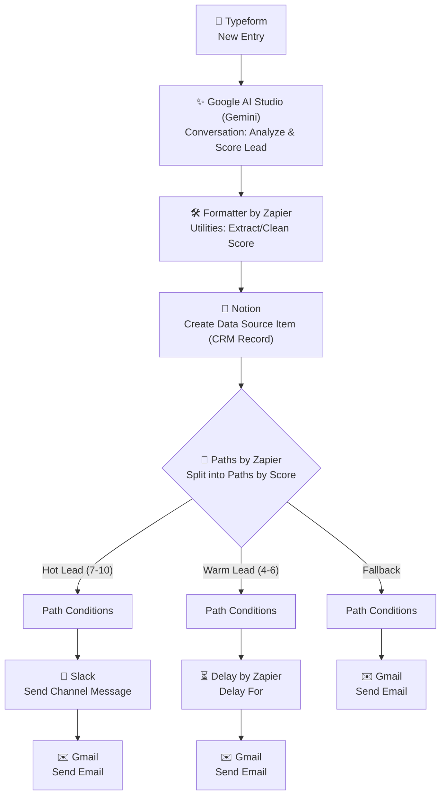

# ai-lead-qualifier-gemini---Zapier
An AI-powered Zapier automation that captures Typeform submissions, qualifies leads using Gemini AI, scores prospects, stores data in Notion, and automatically routes leads with personalized notifications based on priority.
# AI Lead Qualifier — Form → Gemini → Score → CRM

> An AI-powered Zapier automation that captures form submissions, uses Google AI Studio (Gemini) to analyze and score each lead, logs qualified leads into Notion as a CRM, and routes them down Hot / Warm / Fallback paths — automatically triggering the right team notification and follow-up email for each tier.


---

##  Table of Contents

- [Project Overview](#-project-overview)
- [Workflow Diagram](#-workflow-diagram)
- [Features](#-features)
- [Technologies Used](#-technologies-used)
- [Folder Structure](#-folder-structure)
- [Setup Guide](#-setup-guide)
- [Use Cases](#-use-cases)
- [Screenshots](#-screenshots)
- [Troubleshooting](#-troubleshooting)
- [Best Practices](#-best-practices)
- [Contributing](#-contributing)
- [License](#-license)
- [Author](#-author)

---

##  Project Overview

Manually reviewing and scoring every inbound lead slows down sales response time and makes it easy for high-value prospects to get lost among low-intent form fills. **AI Lead Qualifier** solves this with a 13-step Zapier automation that combines form intake, AI-based scoring, CRM logging, and tier-based routing into a single, hands-off pipeline.

Whenever a new lead submits a Typeform, the workflow:

1. Captures the submission via Typeform.
2. Sends the lead's answers to **Google AI Studio (Gemini)** for analysis and scoring.
3. Uses **Formatter by Zapier** to clean and structure the AI's output (e.g., extracting a numeric score).
4. Creates a record in **Notion**, used as a lightweight CRM data source.
5. Splits the lead into one of three paths using **Paths by Zapier**, based on score:
   - **🔥 Hot Lead (Score 7–10):** Notifies the sales team on Slack and sends a personalized follow-up email.
   - **🌤️ Warm Lead (Score 4–6):** Waits a set delay, then sends a nurture follow-up email.
   - **🧊 Fallback (Score below 4 / unscored):** Sends a generic acknowledgment email.

This gives sales teams an automatic, AI-driven triage system — ensuring hot leads are surfaced immediately while warm and low-priority leads still receive appropriate, delayed follow-up.

---

##  Workflow Diagram



A detailed breakdown of each step, including the branching logic, is available in [`docs/workflow-diagram.md`](docs/workflow-diagram.md).

---

## Features

- **AI-Powered Lead Scoring** — Uses Google AI Studio (Gemini) to evaluate lead quality from form responses instead of relying on manual review or rigid scoring rules.
- **Structured Data Cleanup** — Formatter by Zapier ensures the AI's raw output is converted into a clean, usable numeric score before it's stored or routed.
- **Centralized Lead Log (Notion CRM)** — Every lead is recorded in Notion, creating a lightweight, searchable CRM without needing a dedicated CRM platform.
- **Three-Tier Automated Routing** — Hot, Warm, and Fallback paths ensure every lead receives a response appropriate to its priority level.
- **Instant Sales Alerts** — Hot leads trigger an immediate Slack notification, so the sales team can act while interest is highest.
- **Delayed Nurture Sequencing** — Warm leads are handled with a built-in delay before follow-up, avoiding overly aggressive outreach.
- **Guaranteed Fallback Handling** — Even low-scoring or ambiguous leads receive an acknowledgment, so no submission is ever left without a response.
- **Fully No-Code** — Built entirely in Zapier, making the entire pipeline easy to inspect, adjust, and hand off to non-technical team members.

---

##  Technologies Used

| Tool / Service | Role in Workflow |
|---|---|
| **Zapier** | Core automation/orchestration platform |
| **Typeform** | Lead capture form (trigger) |
| **Google AI Studio (Gemini)** | AI-based lead analysis and scoring |
| **Formatter by Zapier** | Cleans and structures the AI's scoring output |
| **Notion** | Lightweight CRM data source for storing lead records |
| **Paths by Zapier** | Conditional branching logic (Hot / Warm / Fallback) |
| **Slack** | Real-time sales team notification for hot leads |
| **Delay by Zapier** | Timed delay before warm-lead follow-up |
| **Gmail** | Sends tier-specific follow-up emails to leads |

---

## Folder Structure

```
ai-lead-qualifier-gemini/
│
├── README.md                     # Main project documentation (this file)
├── LICENSE                       # MIT License
├── CONTRIBUTING.md               # Guidelines for contributing to this project
│
├── docs/
│   └── workflow-diagram.md       # Detailed step-by-step workflow and branching logic
│
└── screenshots/
    └── README.md                 # Index/placeholder for workflow & setup screenshots
```

> **Note:** As this is a Zapier-based automation (not a code application), the repository is documentation-first — structured to showcase design decisions and configuration clearly, the same way source files showcase logic in a coded project.

---

## Setup Guide

Follow these steps to recreate this automation in your own Zapier account.

### Prerequisites

- A Zapier account (a paid plan is recommended, since this Zap uses Paths, Delay, and premium app integrations)
- A Typeform account with a lead capture form already built
- A Google AI Studio account with Gemini API access enabled
- A Notion account with a database set up to act as your CRM data source
- A Slack workspace with a channel for sales notifications
- A connected Gmail account for sending follow-up emails

### Step-by-Step Configuration

**1. Trigger — Typeform: New Entry**
   - App: `Typeform`
   - Trigger event: `New Entry`
   - Select the specific form used to capture leads.

**2. Action — Google AI Studio (Gemini): Conversation**
   - App: `Google AI Studio (Gemini)`
   - Action event: `Conversation`
   - Map the relevant Typeform answers (e.g., company size, budget, timeline, use case) into the prompt.
   - Instruct Gemini to return a lead score from 1–10 along with a brief justification, e.g.: *"Based on the following form responses, score this lead's quality from 1 to 10 and explain briefly why."*

**3. Action — Formatter by Zapier: Utilities**
   - App: `Formatter by Zapier`
   - Utility: Text/Numbers formatting (e.g., "Extract Number" or "Find/Replace")
   - Use this step to isolate a clean numeric score from Gemini's text response, so it can be reliably used in later logic.

**4. Action — Notion: Create Data Source Item**
   - App: `Notion`
   - Action event: `Create Database Item`
   - Map lead details, the AI-generated score, and the justification into your Notion CRM database properties.

**5. Action — Paths by Zapier: Split into Paths**
   - App: `Paths by Zapier`
   - Configure three paths with the following conditions based on the cleaned score from Step 3:
     - **Path A — Hot Lead:** Score is between 7 and 10
     - **Path B — Warm Lead:** Score is between 4 and 6
     - **Path C — Fallback:** Score is below 4, or the condition doesn't match A or B

**6–8. Path A — Hot Lead**
   - **Path Conditions:** Score 7–10
   - **Slack — Send Channel Message:** Notify your sales channel with the lead's name, score, and key details.
   - **Gmail — Send Email:** Send a prompt, personalized follow-up email to the lead.

**9–11. Path B — Warm Lead**
   - **Path Conditions:** Score 4–6
   - **Delay by Zapier — Delay For:** Add a delay (e.g., 1–2 days) before following up, to avoid premature outreach.
   - **Gmail — Send Email:** Send a nurture-style follow-up email after the delay.

**12–13. Path C — Fallback**
   - **Path Conditions:** Catches leads that don't meet Path A or B criteria.
   - **Gmail — Send Email:** Send a general acknowledgment email so every lead receives a response.

### Testing the Zap

1. Turn the Zap on in Zapier.
2. Submit test entries through your Typeform with varying answer quality (to simulate hot, warm, and low-quality leads).
3. Confirm for each test:
   - Gemini returns a sensible score and justification.
   - Formatter correctly extracts a clean numeric value.
   - A record appears in your Notion CRM database.
   - The lead is routed to the correct path (Hot, Warm, or Fallback).
   - The corresponding Slack message and/or Gmail email is sent as expected.

---

## Use Cases

- **Sales Teams** — Automatically prioritize inbound leads so reps focus first on the highest-intent prospects.
- **Freelancers & Consultants** — Qualify inquiries from a contact/intake form without manually reading every submission.
- **Marketing Agencies** — Route client leads captured through campaign forms directly into a lightweight Notion CRM with built-in scoring.
- **Startups** — Implement lead scoring and CRM logging quickly without investing in a full-scale CRM platform.
- **Event & Webinar Follow-Up** — Score and segment post-event form responses into hot prospects vs. general nurture contacts.

---

## Screenshots

Screenshots of the live Zap configuration and sample outputs are organized in the [`screenshots/`](screenshots/) folder.

| Screenshot | Description |
|---|---|
| `01-zap-overview.png` | Full 13-step Zap overview in Zapier, including all three paths |
| `02-typeform-trigger-config.png` | Typeform "New Entry" trigger configuration |
| `03-gemini-scoring-config.png` | Google AI Studio (Gemini) Conversation step configuration |
| `04-formatter-config.png` | Formatter by Zapier score-extraction configuration |
| `05-notion-crm-record.png` | Sample lead record created in Notion |
| `06-paths-conditions.png` | Paths by Zapier condition setup for Hot/Warm/Fallback |
| `07-slack-hot-lead-alert.png` | Sample Slack notification for a hot lead |
| `08-followup-emails.png` | Sample follow-up emails for each lead tier |

> Add your actual screenshots to the `screenshots/` folder using the filenames above, or update the table to match your naming convention.

---

## Troubleshooting

| Issue | Likely Cause | Solution |
|---|---|---|
| Zap doesn't trigger on new form submissions | Typeform not properly connected, or wrong form selected | Reconnect Typeform in Zapier and confirm the correct form is selected in the trigger step |
| Gemini returns a score in an unusable format | Prompt doesn't clearly request a numeric score | Update the prompt to explicitly request "a single number from 1–10" as the first output |
| Formatter step fails to extract a number | AI response format varies too much between runs | Tighten the Gemini prompt to enforce a consistent output structure (e.g., "Score: X") before formatting |
| Lead record missing in Notion | Field mapping mismatch between Zapier and Notion database properties | Verify that Notion database property names/types match the mapped fields exactly |
| Leads routed to the wrong path | Path conditions overlap or reference the wrong field | Double-check each path's condition ranges (7–10, 4–6, fallback) and confirm they reference the cleaned score field |
| Hot lead Slack message not sent | Slack channel disconnected, or bot lacks channel permissions | Reconnect the Slack integration and confirm the bot/app has posting permission in the target channel |
| Warm lead email sent too early or not at all | Delay by Zapier misconfigured | Confirm the delay duration and unit (minutes/hours/days) are set correctly |
| Fallback path never triggers | Path C condition too narrow or overlapping with Path A/B | Set Path C as a true fallback/"else" condition, or explicitly define its score range |

---

## Best Practices

- **Standardize the AI's output format.** Ask Gemini to return the score in a strict, predictable format (e.g., "Score: 8") so Formatter can reliably extract it.
- **Keep scoring criteria explicit.** Define what makes a lead "hot" vs. "warm" clearly in your Gemini prompt, referencing the same fields used in your form.
- **Log every lead, regardless of score.** Writing all leads to Notion — not just hot ones — preserves a complete pipeline history for reporting and prompt refinement.
- **Avoid overlapping path conditions.** Ensure Hot, Warm, and Fallback ranges are mutually exclusive and collectively cover every possible score.
- **Tune your Warm Lead delay.** Test different delay durations to strike the right balance between timely follow-up and appearing overly aggressive.
- **Periodically audit AI scoring accuracy.** Compare a sample of AI-assigned scores against actual conversion outcomes, and refine the prompt as your product or audience evolves.
- **Protect sensitive lead data.** Be mindful of what personal information flows through the AI step and is stored in Notion, especially for compliance-sensitive industries.

---

## Contributing

Contributions, suggestions, and improvements are welcome! Please see [CONTRIBUTING.md](CONTRIBUTING.md) for guidelines on how to propose changes, report issues, or suggest new features for this automation.

---

## License

This project is licensed under the [MIT License](LICENSE) — feel free to use, modify, and adapt this workflow for your own projects.

---

## Author

**AI SMART GALAXY( https://aismartgalaxy.com/ )**
Automation Builder | Zapier & AI-Powered Workflow Enthusiast

This project is part of an ongoing portfolio of no-code and AI-powered automation projects, showcasing practical business use cases built with Zapier — from beginner-level integrations to advanced, AI-driven, multi-path workflows.

- 💼 Open to freelance automation projects and collaborations
- 🔗 Feel free to connect for questions, feedback, or automation consulting

---

 **If you found this project useful or inspiring, consider starring the repository!**
